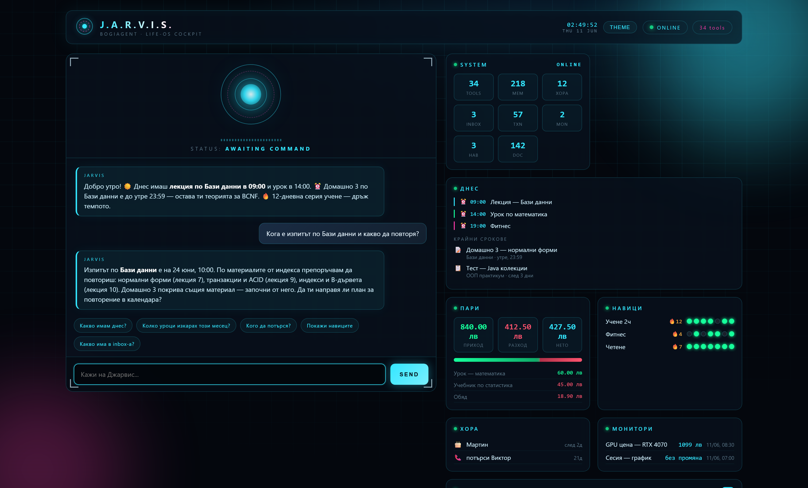
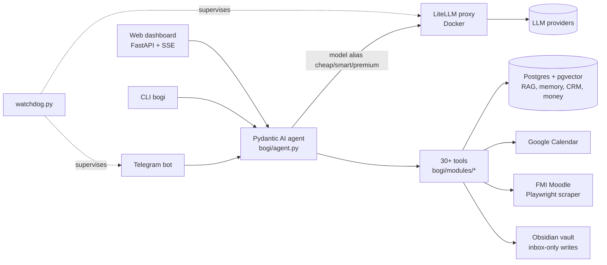

# J.A.R.V.I.S. — Personal Life-OS

A personal AI assistant for a university student — built as a single
integrated system: Telegram bot + web dashboard front-ends, a tool-using LLM
agent in the middle, and real integrations behind it (university Moodle,
Google Calendar, Gmail drafts, Obsidian notes, personal CRM, finances, habits).

> **Note:** this is a sanitized public snapshot of an actively developed
> private project (100+ conventional commits). Personal data, runtime state and
> the full git history stay private — access to the private repo available on
> request. The product speaks Bulgarian to its user (it is built for one);
> the docs and the live demo are in English.

**Stack:** Python 3.12 · Pydantic AI · LiteLLM proxy · PostgreSQL + pgvector ·
python-telegram-bot · FastAPI · Playwright · Docker Compose

### ▶ [Live demo](https://randomzname.github.io/life-os/) — the real dashboard UI running on fictional data (static build, no backend; try asking it about exams, money or memory)



*The web dashboard (live UI, demo data): chat with the agent on the left, HUD
panels on the right — today's agenda + Moodle deadlines, finances, habits,
people follow-ups, web monitors and capture inbox. Screenshot is reproducible
via `scripts/screenshot_dashboard.py` (mocked API, no real data).*

---

## What it does

- **Conversational agent** over Telegram and a local web dashboard, with
  30+ tools the model can call (calendar, email drafts, notes, RAG search,
  money tracking, people CRM, habit tracking, web search, sandboxed code runner).
- **University workflow:** logs into the FMI Moodle, scrapes course materials
  (PDF/DOCX/PPTX), ingests them into Postgres + pgvector, and answers questions
  over them with hybrid RAG (vector ∪ trigram search).
- **Daily brief:** aggregates calendar, deadlines, habits and follow-ups into a
  single morning summary.
- **Long-term memory:** a triage pipeline classifies conversation facts into
  namespaced memories (study topics, projects, people) with dedup and decay.
- **Obsidian integration:** reads the user's vault, writes drafts into an inbox
  folder — never anywhere else.
- **Self-healing ops:** a watchdog supervises the bot, LiteLLM container and
  Postgres; recovery logic restarts unhealthy pieces; singleton lock prevents
  double-starts; rotating logs survive Windows file-lock quirks.

## What it deliberately does NOT do

Safety boundaries are part of the design, not an afterthought:

- **No agent-initiated external writes.** Sending email, submitting forms and
  any outward action go through an explicit **approval queue** — the agent
  proposes, the human approves.
- **Prompt-injection defense:** all external text (scraped pages, emails,
  documents) is wrapped in `<untrusted_content source="...">` markers before it
  reaches the model.
- **Tool permission tiers** (`tool_permissions.py`): each tool is classified
  (read-only / private-data / external-write) and gated accordingly.
- **Code execution** only inside a restricted subprocess runner
  (`code_runner.py`) with no network and a time limit.
- **Secrets hygiene:** a pre-commit hook plus a CI-style test
  (`tests/test_secret_scan.py`) block any commit containing keys, tokens or
  runtime data. `.env`, `data/`, `vault/` are never tracked.
- **No hardcoded model names.** Models are aliased (`cheap` / `smart` /
  `premium`) through a LiteLLM proxy; swapping providers is a one-file config
  change (`litellm/config.yaml`).

## Architecture



Key design rule: `bogi/modules/*` contains **pure Python integrations** with no
framework imports — the agent layer (`agent.py`) is the only place that knows
about Pydantic AI, so any module is testable and reusable in isolation.

## Repo map

| Path | What |
|---|---|
| `bogi/agent.py` | Agent definition: system prompt, tool registration, untrusted-content wrapping |
| `bogi/telegram_bot.py` | Telegram front-end (allowlist auth, voice notes, streaming) |
| `bogi/web/` | FastAPI dashboard (auth, sessions, SSE chat, static UI) |
| `bogi/modules/` | Integrations: calendar, Moodle, RAG documents, memory, money, people, habits… |
| `bogi/models/schema.py` | SQLAlchemy schema (documents, chunks, memories, CRM, life-OS tables) |
| `migrations/` | Alembic migrations |
| `litellm/config.yaml` | Model aliases and provider routing |
| `watchdog.py`, `bogi/recovery.py` | Process supervision and self-healing |
| `docs/` | Architecture, secrets policy, observability plan |
| `tests/` | Pytest suite (no network, no real DB needed for most) |

## Run it

```bash
# 1. Infrastructure
docker compose up -d        # Postgres + pgvector, LiteLLM proxy

# 2. Configure
cp .env.example .env        # fill in tokens (Telegram, LLM provider, …)

# 3. Database
alembic upgrade head

# 4. Go
python -m bogi              # Telegram bot
python -m bogi.web.app      # web dashboard on localhost
pytest                      # test suite
```

## Status

Active personal project. Current focus: approval-queue UX, observability
(OTel `gen_ai.*` spans), and richer memory consolidation. See `docs/` for the
architecture and security write-ups.
